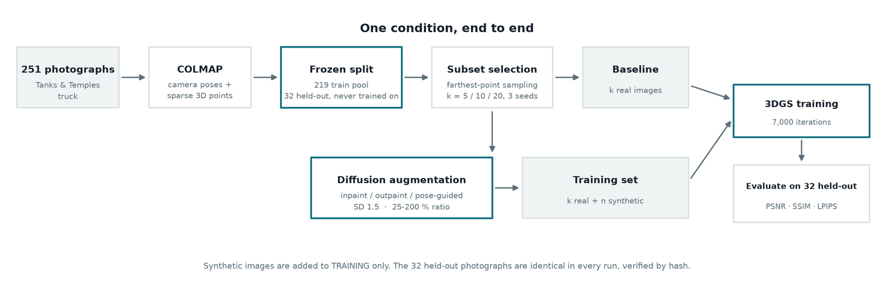
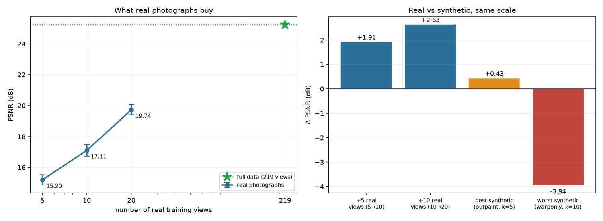
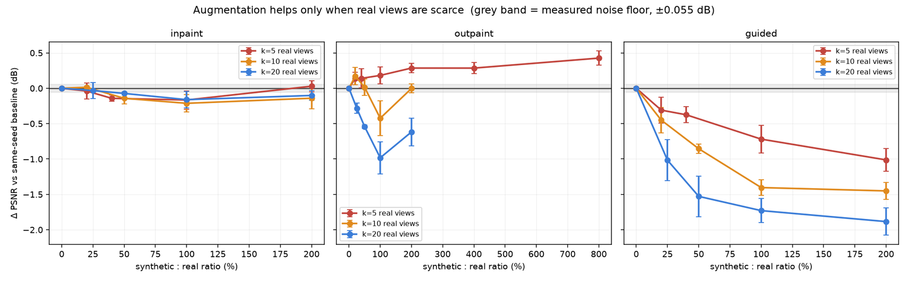
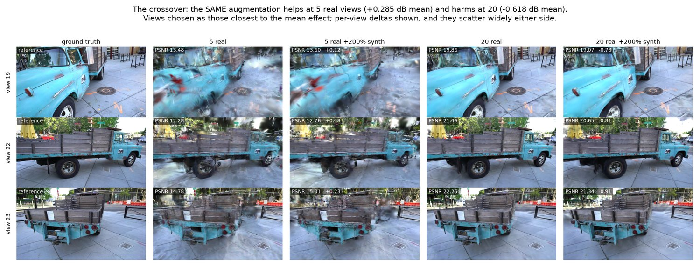
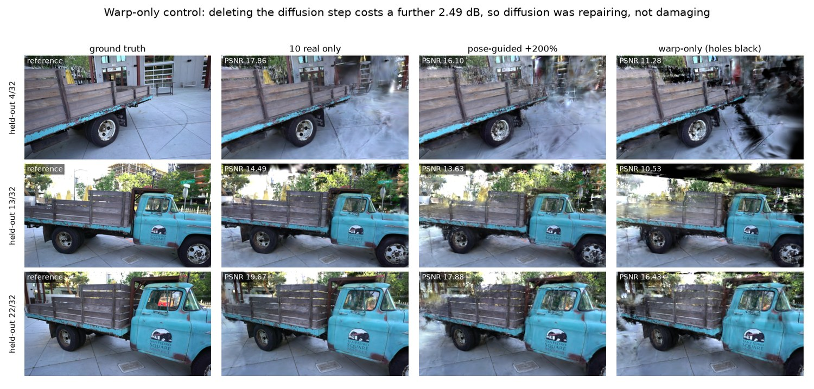
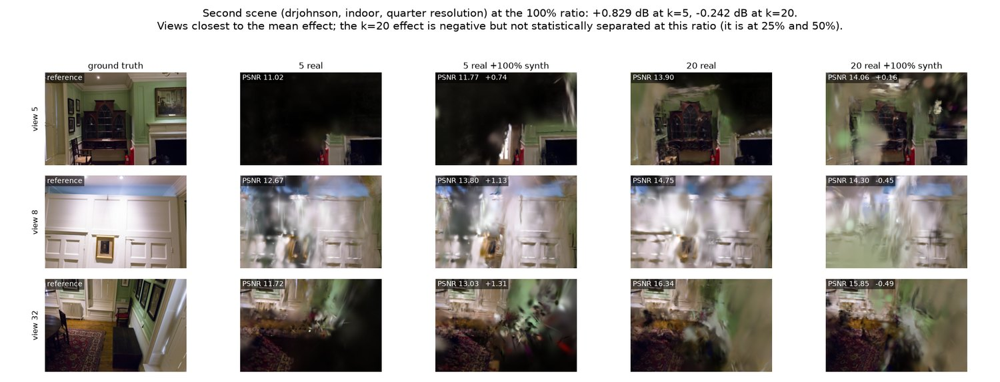
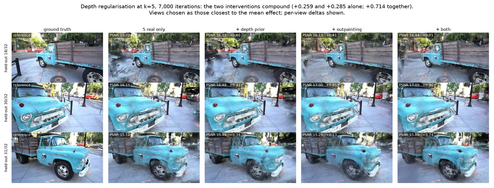
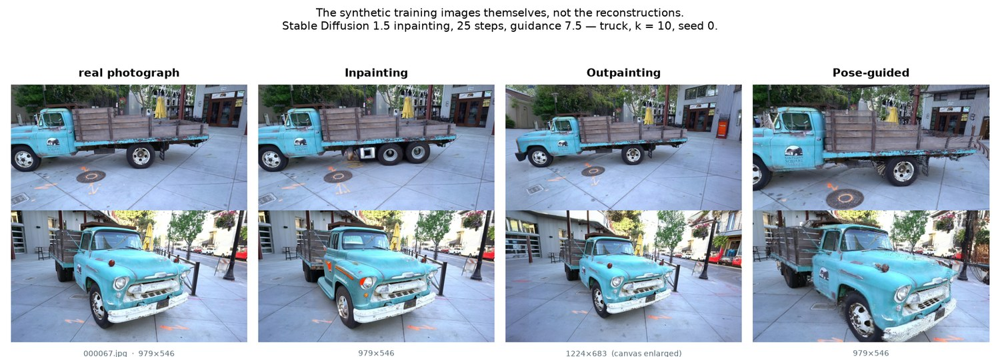
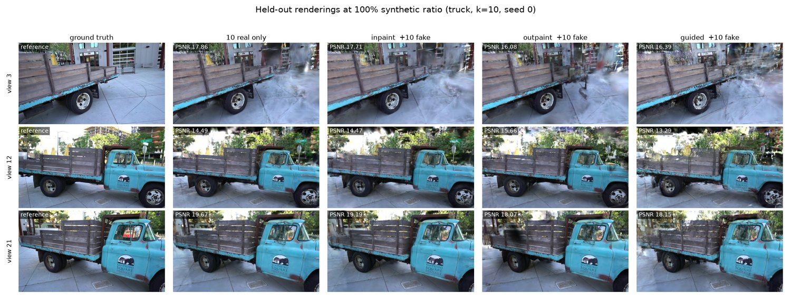
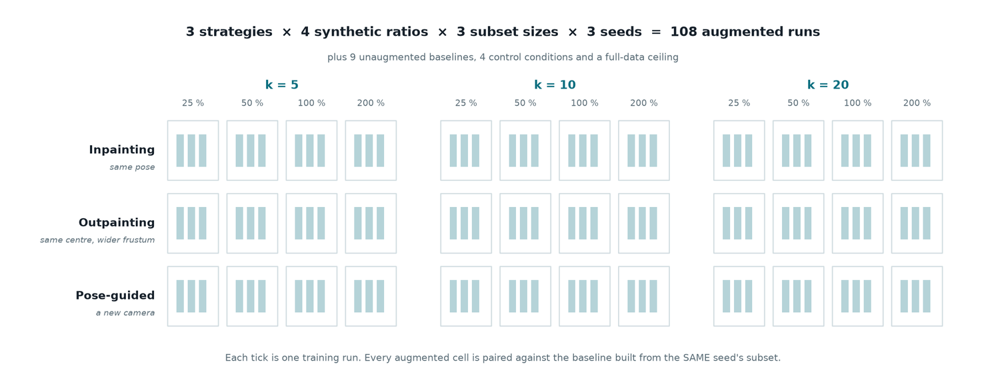

# Few-Shot Gaussian Splatting with Diffusion-Based Data Augmentation

Does generating synthetic training views with a diffusion model help 3D Gaussian
Splatting when you only have a handful of real photographs?

**Short answer: only when you have very few real views, and even then barely.**
The value of a synthetic image depends on how much real data you already have.
It crosses from beneficial to harmful somewhere between 5 and 20 real views.
This repository contains the full pipeline, all 242 training runs, and the
analysis behind that claim.

University of Genoa (UNIGE), robotics project.

---

## Headline result

Scene: Tanks & Temples `truck`, 251 images, 32 held out and frozen across every
run.



*Two lanes into one trainer: k real photographs on their own, or the same k
plus a diffusion-generated set. Everything downstream is identical, so any
difference in the held-out score belongs to the synthetic images.*

### What real photographs are worth

| real views | PSNR | SSIM | LPIPS | Δ | per view |
|---|---|---|---|---|---|
| 5 | 15.20 ± 0.33 | 0.5375 | 0.4096 | — | — |
| 10 | 17.11 ± 0.39 | 0.6584 | 0.3017 | +1.91 | **+0.382** |
| 20 | 19.74 ± 0.33 | 0.7842 | 0.2027 | +2.63 | **+0.263** |
| 219 | 25.23 | 0.9070 | 0.1227 | +5.50 | +0.028 |

### What synthetic images are worth

ΔPSNR against the same seed's own baseline at the same subset size. 3 seeds.
`*` = |mean| exceeds the between-seed standard deviation.

**Outpainting.** Crosses from helpful to harmful:

| ratio | k=5 | k=10 | k=20 |
|---|---|---|---|
| 20–25 % | +0.140 \* | **+0.172** \* | −0.283 \* |
| 40–50 % | +0.140 \* | +0.013 | −0.542 \* |
| 100 % | **+0.182** \* | −0.423 \* | −0.983 \* |
| 200 % | **+0.285** \* | −0.003 | −0.618 \* |

**Inpainting.** Flat, and the only strategy independent of subset size:

| ratio | k=5 | k=10 | k=20 |
|---|---|---|---|
| 100 % | −0.166 \* | −0.213 \* | −0.161 \* |
| 200 % | +0.029 | −0.141 | −0.102 \* |

**Pose-guided.** Harmful everywhere, and worse the more real data it is added to:

| ratio | k=5 | k=10 | k=20 |
|---|---|---|---|
| 20–25 % | −0.309 \* | −0.451 \* | −1.017 \* |
| 200 % | −1.013 \* | −1.451 \* | −1.884 \* |

Measured training noise floor is σ = 0.039 dB (≈ 0.055 dB paired), so these
effects are real even where small.





### The finding

Pose novelty explains all three behaviours. Order the strategies by how much
new *camera pose* each invents:



*The same 200 % outpainting at 5 real views (top) and 20 (bottom). Views chosen
as those closest to the mean effect; per-view deltas scatter widely either
side.*


| | new pose | new information | new contradiction | effect |
|---|---|---|---|---|
| inpainting | none — pose copied | none | none | ~0, regardless of k |
| outpainting | same centre, wider frustum | some | some | helps when starved, hurts when not |
| pose-guided | fully novel viewpoint | most | most | always hurts, worse as baseline improves |

A synthetic view supplies coverage and inconsistency in fixed proportion.
Coverage loses value as real views accumulate; inconsistency does not. Two
terms, one decaying and one roughly constant, produce a sign change — which is
what the data show.

The exchange rate: the best synthetic condition anywhere (+0.285 dB) is
6.7× less valuable than simply taking five more photographs (+1.91 dB).

### The control: is diffusion to blame?



*The control warps to bit-identical poses and leaves the holes black, never
loading Stable Diffusion. It is 2.49 dB worse, so the fabricated pixels are not
what does the damage.*


Pose-guided changes two things at once: the camera pose, and the ~10% of pixels
diffusion invents to fill disocclusions. A control separates them: warp to
bit-identical poses, then leave the holes black and never load Stable
Diffusion (`src/gen_warponly.py`).

| ratio | pose-guided (warp + SD) | warp-only (holes black) | diffusion's contribution |
|---|---|---|---|
| 20 % | −0.451 \* | −1.278 \* | **+0.827** |
| 50 % | −0.855 \* | −2.191 \* | **+1.336** |
| 100 % | −1.404 \* | −3.441 \* | **+2.037** |
| 200 % | −1.451 \* | −3.939 \* | **+2.488** |

Removing diffusion makes it far worse. The diffusion step contributes up to
+2.49 dB of repair; SSIM and LPIPS agree at every ratio. So the pose-guided
damage is *not* caused by hallucinated hole content or warping artifacts — the
stage responsible for both is the stage holding the result up. What remains is
pose novelty itself.

Caveat: black rectangles are a severe artifact, so part of that +2.49 dB is
diffusion beating a low bar. The control proves diffusion is net positive,
which rules it out as the cause. It does not prove the output is good.

### Does it generalise? A second scene



*Deep Blending `drjohnson`: an indoor room, a different dataset, the same sign
change.*


Everything above is `truck`: one outdoor scene, one object. Deep Blending's
`drjohnson` (230 views, indoor room) repeats the outpainting sweep at the two
ends of the crossover: k = 5 and k = 20, 3 seeds, 24 runs.

| ratio | truck k=5 | drjohnson k=5 | truck k=20 | drjohnson k=20 |
|---|---|---|---|---|
| 20–25 % | +0.140 \* | +0.239 \* | −0.283 \* | −0.310 \* |
| 40–50 % | +0.140 \* | +0.134 \* | −0.542 \* | −0.147 \* |
| 100 % | +0.182 \* | **+0.829** \* | −0.983 \* | −0.242 |
| 200 % | +0.285 \* | **+0.989** \* | −0.618 \* | +0.195 |

The sign flip reproduces. k = 5 is positive at every ratio in both scenes;
k = 20 is negative at every statistically separated point in both.

The effect is *stronger* indoors, and on better evidence:

- the k = 5 benefit is 3.5× larger (+0.989 vs +0.285 at 200 %);
- **all three metrics agree.** On truck, outpainting bought PSNR while SSIM sat
  flat (−0.001 at 200 %). On drjohnson SSIM improves +0.049 and LPIPS
  improves −0.011 alongside it.

The two non-significant k = 20 cells (100 %, 200 %) are the only places the
pattern softens, and LPIPS is worse there at *every* ratio, 200 % included, so
the one positive PSNR cell is not a counterexample so much as a metric
disagreement.

Why the paired design earns its keep here. drjohnson's baselines scatter
across seeds far more than truck's (± 1.68 dB at k = 5, vs truck's ± 0.33). An
unpaired comparison at that noise level could not resolve a 0.2 dB effect at
all. Pairing each augmented run against *its own seed's* baseline holds the
paired standard deviations to ± 0.10–0.52 and keeps the effects measurable.

Scaling, for reference (not comparable to truck — see below):

| k | 5 | 10 | 20 | 230 (ceiling) |
|---|---|---|---|---|
| PSNR | 12.55 | 14.03 | 16.50 | 28.30 |

**Resolution caveat.** drjohnson trains at `--resolution 4`, truck at `2`: a
230-view drjohnson run at half resolution exceeds the 4 GB card and thrashes
(5 s/iter against 18 it/s, a 17× slowdown). Absolute PSNR is therefore *not*
comparable between the two scenes. Every delta in the table above is computed
within a scene against its own same-seed baseline, which is unaffected by the
resolution choice. All 34 drjohnson runs use the same resolution, so the
scene's internal scaling curve is self-consistent.

### Testing the mechanism: a depth prior



*A depth constraint invents no camera and no pixel, and stays positive at every
subset size.*


The explanation above predicts something that could fail. If the harm comes from
inconsistency rather than from augmentation as such, then an intervention
supplying geometric constraint *without inventing a viewpoint* should never
cross over: it has no contradictory geometry to accumulate.

Monocular depth regularisation is that intervention: a depth network predicts an
inverse-depth map per real training photo, anchored to scene scale against the
sparse COLMAP points that view observes (median R² 0.964). No camera is
invented, no pixel fabricated. Synthetic views get no depth supervision,
since estimating depth from a fabricated image to constrain geometry would be
circular.

A 3×2×2 factorial (subset size × outpainting × depth prior), 3 seeds, paired:

| | k=5 | k=10 | k=20 |
|---|---|---|---|
| **+ depth prior** | +0.259 \* | +0.163 \* | **+0.155** \* |
| **+ outpainting (200%)** | +0.285 \* | −0.003 | **−0.618** \* |
| **+ both** | +0.714 \* | +0.294 \* | −0.355 \* |
| *interaction* | +0.169 \* | +0.134 | +0.108 \* |

The prediction holds. Coverage crosses over; constraint does not. The depth
prior is positive and statistically separated at *every* subset size, including
k=20 where outpainting costs 0.618 dB. The two interventions differ in exactly
one respect: whether a camera that never existed is invented. Only the one
that invents a camera reverses sign.

The shape agrees too: the prior's benefit *decays* (+0.259 → +0.163 → +0.155),
exactly as diminishing returns on constraint predict. It simply never turns
negative, because there is no contradiction term to overtake it.

They also compound. At k=5 the combination reaches **+0.714 dB**, the largest
improvement anywhere in this study, with a positive interaction at all three
subset sizes. They repair different deficiencies: outpainting supplies
peripheral *content* no real view recorded; the prior supplies *constraint* on
geometry already observed.

**What to actually do**, now evidenced rather than argued:

| you have | do this | gain |
|---|---|---|
| 5 real views | both | +0.714 |
| 10 real views | both | **+0.294** (outpainting alone is inert) |
| 20 real views | **depth only** | +0.155 (adding synthetic costs ~0.5 dB) |

Depth is also the cheaper and cleaner intervention: it improves all three
metrics where outpainting buys PSNR while degrading SSIM, and costs +6.6% Gaussians against outpainting's +103%.

#### It also outlasts augmentation

Train to 30,000 iterations and the two part company. This is the sharpest
test the account has faced, and it was predicted before the runs:

| k=5, paired | 7,000 | 30,000 |
|---|---|---|
| + depth prior | +0.259 \* | **+0.208** \* |
| + outpainting (200%) | +0.285 \* | **−0.078** |
| + both | +0.714 \* | **+0.469** \* |

Outpainting's benefit is gone; the prior's is not. Fabricated pixels give the
optimiser more contradictory data to memorise as training lengthens. A depth
constraint invents nothing, so it has no contradiction to accumulate.

A third training length was measured to check that 7,000 is not a flattering
choice. Outpainting at k=5 decays monotonically (+0.285 at 7,000, +0.045 at
15,000, −0.078 at 30,000), but the unaugmented baseline does not improve
either: 15.20 → 15.22 → 15.04 dB across the same three points. Flat to 15,000
and lower by 30,000 means few-shot splatting is over-training, not converging,
so 7,000 is a fair operating point. The augmentation gain is still conditional
on it; the depth prior is not.

**Two results that run against this**, both stated in the report rather than
buried:

- At k=20 the prior is +0.130 dB at 30,000, no longer separated from
  zero, and the combination stays negative (−0.372). The prior does not
  rescue augmentation once twenty real views already pin the geometry.
- The super-additivity is single-scene. On drjohnson the interaction is
  +0.075 ± 0.672 dB, additive within noise. What reproduces on both scenes
  is only the weaker claim: the interaction is never *negative*, which is what
  two interventions repairing the same deficiency would show.

```bash
bash src/run_depth_reg.sh              # k=5
bash src/run_depth_k10_k20.sh          # k=10 and k=20
bash src/run_30k_depth.sh              # the same 2x2 at 30,000

# the 2x2 table. K, NF, SCENE and OUTDIR are all environment parameters:
$VPY src/depth_compare.py                                   # truck, 7,000
SCENE=drjohnson $VPY src/depth_compare.py                   # second scene
OUTDIR=runs_30k K=20 NF=40 $VPY src/depth_compare.py        # k=20 at 30,000
```

> `depth_compare.py` hardcoded `truck_` and `runs/` until commit `41d18a8`, so
> running it after a `SCENE=drjohnson` sweep printed the truck table under
> six correct drjohnson runs. The table named no scene, which is exactly why it
> would have been believed. Its header now names scene and iteration budget.

> **Note on the upstream depth utility.** `gaussian-splatting/utils/make_depth_scale.py`
> is broken on the OpenCV version this project pins: it slices its `cv2.remap`
> output as `[..., 0]`, which takes the first *column* of a `(1, N)` result rather
> than a channel, collapsing every image to one sample and emitting `scale=inf`.
> That poisons the median in `dataset_readers.py` and fails every image at the
> reliability gate in `cameras.py`, silently disabling depth supervision
> entirely. [`src/make_depth_params.py`](src/make_depth_params.py) replaces it;
> [`src/check_depth_coverage.py`](src/check_depth_coverage.py) gates the sweep so
> a plumbing fault can never again masquerade as a null result.

## Repository layout

```
src/                    all pipeline code (see "Reproducing" below)
patches/                the three required edits to upstream 3DGS
subsets/                view-selection manifests + the frozen test split
synthetic/              every generated image + poses.json (source-view linkage)
figures/                the panels and plots this README argues with
runs/*/results.json     raw metrics for all 242 runs - the experimental record
build_rasterizer.sh     one-shot CUDA submodule build
requirements.txt        Python dependencies
CAPTURE.md              capturing a custom scene with COLMAP
```

Not committed (see `.gitignore`): `venv/` (7.5 GB), `data/` (1.4 GB, downloaded),
`gaussian-splatting/` (upstream clone), `runs/` checkpoints and renders (~15 GB),
`scenes/` (symlink farms with absolute paths, regenerate them), and
`results/`, which holds the figures and tables rebuilt from
`runs/*/results.json` by the analysis scripts.

---

## Setup

Built and tested on WSL2 Ubuntu 24.04, RTX 3050 Ti Laptop (4 GB VRAM),
7.6 GB RAM. The 4 GB budget is the binding constraint throughout and is why
several design decisions look the way they do.

### 1. CUDA toolkit

You need `nvcc` matching your PyTorch CUDA version (12.8 here).

```bash
# NVIDIA's apt repo - Ubuntu 24.04, exact 12.8 match
wget https://developer.download.nvidia.com/compute/cuda/repos/ubuntu2404/x86_64/cuda-keyring_1.1-1_all.deb
sudo dpkg -i cuda-keyring_1.1-1_all.deb && sudo apt update
sudo apt install -y cuda-toolkit-12-8
```

> **Two dead ends worth avoiding.** Ubuntu's own `nvidia-cuda-toolkit` package
> is CUDA 12.0, which does not compile against GCC 13 (the 24.04 default).
> And the pip wheels `nvidia-cuda-nvcc-cu12` (12.8.93 / 12.9.86) ship `ptxas`
> only — there is no `nvcc` frontend inside them, so `pip install`-ing your way
> to a compiler does not work.

### 2. Python environment

```bash
python3.12 -m venv venv
./venv/bin/pip install torch==2.9.1 torchvision --index-url https://download.pytorch.org/whl/cu128
./venv/bin/pip install -r requirements.txt
```

### 3. Upstream 3DGS + patches

```bash
git clone https://github.com/graphdeco-inria/gaussian-splatting --recursive --depth 1
cd gaussian-splatting
git apply ../patches/01-dataset_readers-split-and-uint8.patch
git apply --directory=submodules/diff-gaussian-rasterization \
          ../patches/02-rasterizer-cstdint.patch
git apply ../patches/03-camera_utils-composite-rgba.patch
cd ..
```

Verified against upstream `54c035f` (main repo) and `9c5c202`
(diff-gaussian-rasterization).

**What the patches do, and why each is mandatory:**

| patch | reason |
|---|---|
| `02-rasterizer-cstdint` | GCC 13 stopped including `<cstdint>` transitively. Without it the build dies on `'uintptr_t' is not a member of 'std'`. One line; purely a compiler-compatibility fix. |
| `01-dataset_readers-split-and-uint8` | **Two fixes in one file.** (a) Upstream picks the test set with the LLFF rule `idx % 8 == 0` and trains on *everything else*. This project needs an arbitrary K-image training subset while the test set stays byte-identical across every run; the patch lets a `split.json` in the scene root override the rule, and with no such file behaviour is exactly as upstream. (b) The Blender loader builds frames with `dtype=np.byte`, which is *signed* int8 — values above 127 wrap negative and PIL rejects the buffer (`Cannot handle this data type: (1,1,3), \|i1`). Fatal on any recent numpy. |
| `03-camera_utils-composite-rgba` | The Blender loader composites each RGBA frame over the requested background and then **discards the result**, keeping only `image.size` to compute the FOV; `loadCam` re-opens the raw file. So `--white_background` never reaches the pixels — it only recolours the rasteriser's background, *creating* a mismatch. The retained alpha then becomes a mask that `train.py` multiplies into the loss, so background pixels are never penalised, while evaluation applies no mask and scores the resulting floaters over ~70% of each frame. Measured on `lego` with all 100 views: **2.61 dB** with `-w`, **6.08 dB** without, **33.77 dB** once `loadCam` composites the RGBA itself — against ~33 dB published. Only needed for NeRF-Synthetic scenes; the COLMAP path never enters this code. |

### 4. Build the CUDA submodules

```bash
bash build_rasterizer.sh
```

> **`--no-build-isolation` is required.** The three submodules' `setup.py` files
> import `torch` at module level, and PEP 517 build isolation hides the venv's
> torch from them. Without the flag pip fails with a bare
> `get_requires_for_build_wheel ... exit 1` that says nothing about the cause.
> The script also sets `TORCH_CUDA_ARCH_LIST="8.6"` (build for this GPU only —
> far faster) and `MAX_JOBS=4` (each `nvcc` job is memory-hungry).

The script ends with an import test; all three of
`diff_gaussian_rasterization`, `simple_knn._C`, `fused_ssim` must load.

### 5. Data

```bash
mkdir -p data && cd data
wget https://storage.googleapis.com/gresearch/refraw360/360_v2.zip  # or:
# Tanks & Temples from the 3DGS release:
#   https://repo-sam.inria.fr/fungraph/3d-gaussian-splatting/datasets/input/tandt_db.zip
```

Expected at `data/tandt/truck/` with `images/` (251 JPEGs, 979×546) and
`sparse/0/` (COLMAP binary model at 1957×1091, PINHOLE). Inspect a model with
`./venv/bin/python src/inspect_colmap.py`.

---

## Reproducing the experiments

Total compute ≈ 15 hours on the 4 GB laptop GPU. Every stage is idempotent —
`run_experiment.py` skips any scene that already has a `results.json`, so an
interrupted batch can simply be re-run. This matters: the sweep was interrupted
twice during development (once by a full host disk, once by a CUDA OOM) and both
times resumed without losing completed work.

```bash
VPY=./venv/bin/python

# 1. Choose the few-shot subsets and freeze the test split.
#    Farthest-point sampling over camera centres, 3 seeds. Writes
#    subsets/*.json, test_split.json, and camera-position maps.
$VPY src/select_subsets.py --k 5 10 20 --seeds 0 1 2 --methods fps random --plot

# 2. Full-data ceiling (219 real views).
$VPY src/make_full_manifest.py
$VPY src/build_scene.py --manifest subsets/truck_k219_seed0_full.json
$VPY src/run_experiment.py --scene scenes/truck_k219_seed0_full_fake0

# 3. Few-shot floors at every subset size (k = 5, 10, 20 x 3 seeds).
KS="5 10 20" bash src/run_floors.sh

# 4. The augmentation sweep at k=10 (3 strategies x 4 ratios x 3 seeds).
STRATEGY=inpaint  bash src/run_curve.sh
STRATEGY=outpaint bash src/run_curve.sh
STRATEGY=guided   bash src/run_curve.sh

# 5. The same sweep at k=5 and k=20 (72 more runs, ~8 h).
bash src/run_all_scales.sh

# 6. Noise floor: same scene, same config, 3 repeats.
bash src/measure_train_noise.sh

# 7. Second scene (drjohnson): floors, ceiling and the outpainting sweep at
#    k=5 and k=20. RES=4 throughout - see the resolution caveat above.
$VPY src/select_subsets.py --source data/db/drjohnson \
     --k 5 10 20 --seeds 0 1 2 --methods fps --plot
$VPY src/make_full_manifest.py --split subsets/drjohnson_test_split.json
RES=4 SCENE=drjohnson SOURCE=data/db/drjohnson KS="5 10 20" bash src/run_floors.sh
$VPY src/build_scene.py --manifest subsets/drjohnson_k230_seed0_full.json \
     --source data/db/drjohnson --force
$VPY -u src/run_experiment.py --scene scenes/drjohnson_k230_seed0_full_fake0 \
     --iterations 7000 --resolution 4
bash src/run_drjohnson_sweep.sh          # 24 runs, ~2.5 h

# 7c. Robustness sweeps. Each answers one objection to the headline result and
#     is independent of the others, so they can be run in any order or skipped.
bash src/run_random_sweep.sh    # 18 runs, ~2.5 h. Subsets drawn at RANDOM rather
                                # than by FPS: does the crossover depend on having
                                # chosen the five views well?
bash src/run_ds8_crossover.sh   #  9 runs, ~1.5 h. Dreamshaper-8 at k=10 and k=20,
                                # completing a checkpoint swap that previously
                                # covered only k=5.
bash src/run_30k.sh             # 12 runs, ~5 h. The two headline cells at 30,000
                                # iterations instead of 7,000.
bash src/run_30k_depth.sh       # 12 runs, ~5 h. The depth 2x2 at 30,000, to see
                                # whether constraint survives where invention does
                                # not.

# The last two write to runs_30k/, NOT runs/. A 30,000-iteration run of an
# existing condition matches it on scene, k, seed, selection method and
# strategy, so in runs/ it would overwrite the 7,000-iteration baseline in
# every paired key in the analysis.

# 8. Analysis, tables and figures.
$VPY src/collect_results.py   # -> results/summary.md, results/runs_raw.csv (all scenes)
$VPY src/validate_runs.py     # four internal-consistency checks, all scenes
$VPY src/crossover_table.py             # truck: the headline matrix, to stdout
$VPY src/crossover_table.py drjohnson   # the same matrix for the second scene
$VPY src/plot_curves.py       # -> results/{curves_paired,scaling,curves_absolute}.png
$VPY src/make_panels.py       # -> results/panel_*.png
$VPY src/make_panels_extra.py # -> the panels make_panels.py does not cover
```

`validate_runs.py` is worth running after any sweep. It checks four things that
need no external reference: that every run of a scene is scored against
byte-identical held-out images, that train and test never overlap, that each
training set really holds `k + n_synthetic` images, and that baselines do not
get worse as real views are added. The first is the one that matters — two
conditions disagreeing about the answer sheet are not comparable, however
correct the training was.

Synthetic counts differ per subset size because the ratio is relative to `k`:

| k | fakes | realised ratios |
|---|---|---|
| 5 | 1 2 5 10 | 20 / 40 / 100 / 200 % |
| 10 | 2 5 10 20 | 20 / 50 / 100 / 200 % |
| 20 | 5 10 20 40 | 25 / 50 / 100 / 200 % |

Only k=20 divides cleanly into the spec's 25/50/100/200%; at k=5 and k=10 the
25% point is fractional (1.25 and 2.5 images) and rounds down.

> **Disk.** The 242 runs produce ~3 GB once each block deletes its checkpoints
> (`runs/*/point_cloud`). Every metric is extracted into `results.json` during
> the run, so the checkpoints can be deleted afterwards — `rm -rf
> runs/*/point_cloud runs/*/input.ply` — without losing anything the analysis
> needs. On WSL, freeing space inside the distro does not return it to Windows;
> compact the vhdx with `diskpart` (`attach vdisk readonly` / `compact vdisk` /
> `detach vdisk`) from an Administrator prompt.

Geometry unit tests for the pose-guided warp (CPU only, no GPU needed):

```bash
$VPY src/test_warp.py
```

Test 1 warps a view onto its own pose: 99.43 % coverage, mean |diff| 0.0000,
rotation error 1.1e-16. Test 2 checks that hole fraction grows monotonically
with baseline (4.47 % → 8.84 % → 16.65 %) and that interpolation fraction 1.0
lands on the neighbour pose to 2.2e-16.

---

## The three strategies



*The synthetic training images themselves. Inpainting returns the same frame
with a region regenerated; outpainting returns a larger canvas with invented
periphery; pose-guided returns a viewpoint that was never photographed.*



*And what each does to the reconstruction: held-out renders at the same ratio
and subset size.*


Each is defined by how it obtains a camera pose for the synthetic image —
that turns out to be what determines whether it helps or hurts.

| | pose | what is synthesised | src |
|---|---|---|---|
| **Inpainting** | copied exactly from the real view | a random 8–22 % rectangle/ellipse, composited back at native resolution so only masked pixels are synthetic | [`gen_inpaint.py`](src/gen_inpaint.py) |
| **Outpainting** | same centre, widened intrinsics | the border ring around the real frame; focal lengths unchanged, principal point shifted, FOV 80.1°×50.5° → 92.9°×61.1° | [`gen_outpaint.py`](src/gen_outpaint.py) |
| **Pose-guided** | a **new** pose interpolated between two real cameras | monocular depth (Depth Anything V2) anchored to sparse COLMAP points, forward-warped with a z-buffer, disocclusion holes filled by diffusion | [`gen_guided.py`](src/gen_guided.py) |

Depth anchoring solves a least-squares scale/shift in disparity space
(`pred_disp * a + b ≈ 1/z_colmap`) at the sparse keypoints, with 95th-percentile
residual trimming. Mean R² across views = 0.988.

Filenames encode the linkage the brief asks for:
`synth_<strategy>_<source_view>_v<NN>.jpg`, with full camera parameters in each
directory's `poses.json`.

Stable Diffusion 1.5 inpainting runs at 704×392 with `variant="fp16"`,
attention slicing and VAE slicing: 2.65 GB peak, which fits 4 GB only because
diffusion and 3DGS training never run concurrently.

---

## Experimental design notes




- **Frozen test set.** 32 views chosen by the LLFF `idx % 8` rule and held
  constant across all 242 runs. No synthetic image is ever derived from a test
  view.
- **Nested synthetic sets.** The 5-image condition contains the 2-image
  condition's images, and so on, so the ratio sweep is a genuine dose-response
  curve rather than four unrelated samples.
- **Paired comparison.** Every delta is against the *same seed's* own 0-fake
  baseline, which removes the large between-seed variance (σ = 0.39 dB) that
  otherwise swamps effects an order of magnitude smaller.
- **Measured noise floor.** Python RNG is seeded, so residual variation is CUDA
  `atomicAdd` nondeterminism in the rasteriser backward pass, amplified by
  densification. Three identical repeats give σ_PSNR = 0.039 dB. Any claimed
  effect below ≈ 0.055 dB paired is not distinguishable from noise, and the
  report says so.
- **Cost accounting.** `run_experiment.py` samples VRAM from a monitor thread
  and records wall-clock training time and final Gaussian count in every
  `results.json`.

---

## Known limitations

- **The warp-only control uses black holes**, which is a harsh comparison. It
  shows the diffusion step is net positive and therefore not the cause of the
  pose-guided damage, but not how good the diffusion output is in absolute
  terms. A gentler control (classical inpainting instead of diffusion) would
  separate "diffusion specifically" from "any plausible fill".
- **The control was run at k=10 only.** Whether diffusion stays net positive at
  k=5 and k=20 is untested.
- **The crossover position depends on the ratio.** At the 200 % ratio k=10
  sits at −0.003 dB, on zero, so the sign change is located there; at 100 % k=10
  is already −0.423, so it falls between 5 and 10. Three subset sizes fix the
  crossover for one ratio and bracket it for the others.
- **Two scenes, one of them partial.** The crossover is confirmed on `truck`
  (outdoor object) and `drjohnson` (indoor room), but drjohnson was swept for
  outpainting only, at k = 5 and k = 20, the two ends of the crossover.
  Inpainting and pose-guided were not repeated there, so "inpainting is flat"
  and "pose-guided always hurts" remain single-scene claims. drjohnson also
  runs at a different resolution (`-r 4`), so only within-scene deltas
  transfer, never absolute PSNR.
- **One architecture, two checkpoints.** The sweep uses SD 1.5 inpainting,
  chosen for the 4 GB budget. DreamShaper-8 repeats 21 cells as a second
  checkpoint and the harm reproduces, slightly stronger: at k=20 and the 200 %
  ratio, −0.618 dB against −0.825. Both are SD 1.5 finetunes, so this tests the
  checkpoint and not the architecture. SDXL and FLUX do not fit in 4 GB, and
  neither do the multi-view-consistent generators (Zero123++, SV3D, ImageDream)
  that are arguably the actual fix for what pose-guided augmentation attempts.
  `src/check_alt_models.sh` enumerates what was considered.
- **The main grid runs to 7,000 iterations, not the upstream 30,000**, to keep
  242 runs tractable on a 4 GB GPU. Thirty-six runs repeat key conditions at
  15,000 and 30,000 to check that the choice is not doing the work; the
  unaugmented baseline does not improve over that range either (15.20 → 15.22 →
  15.04 dB). The full-data run reaches 25.23 dB against ≈ 25.4 dB published at
  the full schedule, so the pipeline is validated, but absolute numbers sit
  slightly below literature values.
- **Random selection was sampled, not swept.** Eighteen runs repeat the
  baseline and the 200 % outpainting cell with uniformly drawn subsets instead
  of farthest-point ones. Placement is worth 0.369 dB at k=10 and 0.675 dB at
  k=20, and augmentation is *more* harmful on the worse-covered subsets
  (−0.929 against −0.618 at k=20) — which the coverage account does not
  obviously predict and which two subset sizes cannot settle.

---

## Hardware and cost

| stage | peak VRAM | time |
|---|---|---|
| Diffusion generation (SD 1.5 fp16, 704×392) | 2.65 GB | ~2 min / 20 images |
| Few-shot training (10–30 views, 7000 iters) | 1.4 GB | ~5 min |
| Full-data training (219 views, 7000 iters) | 3.0 GB | ~8 min |

Peak across the whole project stayed under 3.0 GB. Diffusion and training are
never concurrent — an early baseline was contaminated by exactly that mistake
and had to be discarded and re-run.

---

## References

- Kerbl et al., *3D Gaussian Splatting for Real-Time Radiance Field Rendering*,
  SIGGRAPH 2023 — [graphdeco-inria/gaussian-splatting](https://github.com/graphdeco-inria/gaussian-splatting)
- Yang et al., *Depth Anything V2*, NeurIPS 2024
- Rombach et al., *High-Resolution Image Synthesis with Latent Diffusion Models*,
  CVPR 2022 — Stable Diffusion 1.5 inpainting
- Knapitsch et al., *Tanks and Temples*, SIGGRAPH 2017 — the `truck` scene
